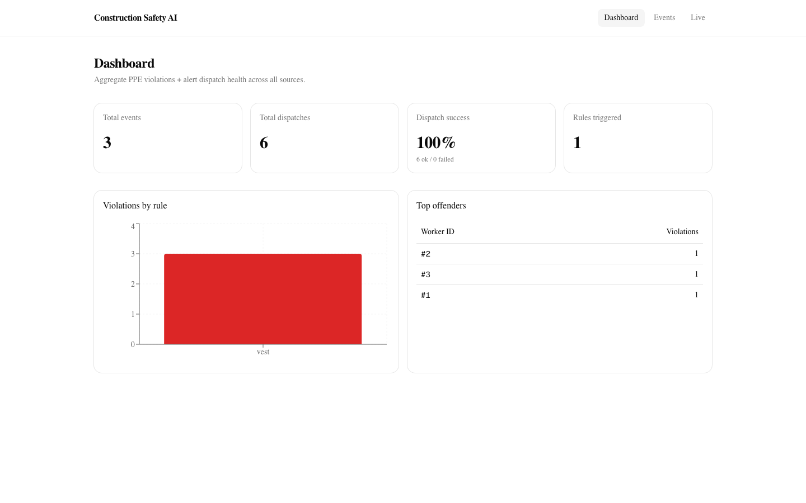
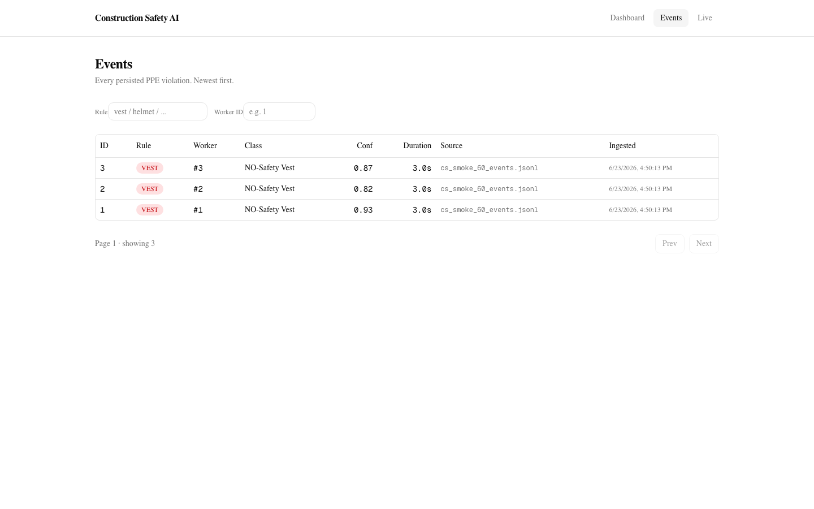
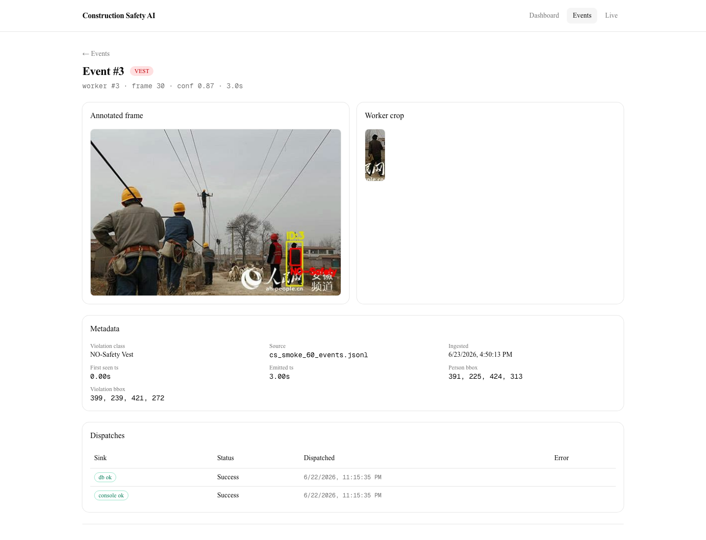
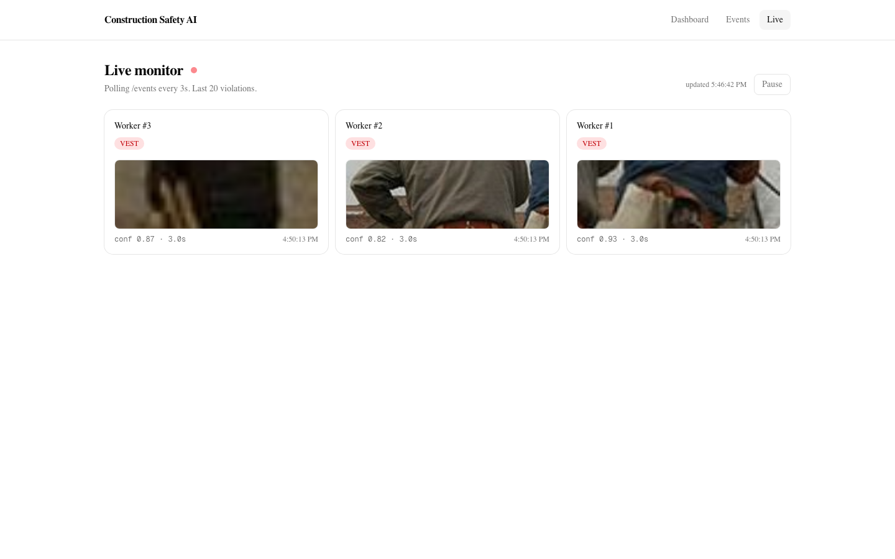
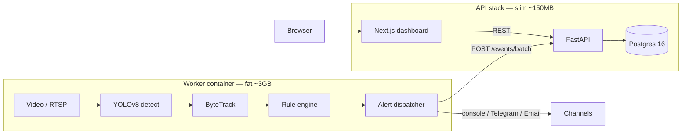

# Construction Safety AI

[](https://github.com/EmilianoLescuras/Construction-Safety-AI/actions/workflows/ci.yml)
[](LICENSE)
[](https://www.python.org/)

End-to-end computer-vision platform for **PPE compliance monitoring on
construction sites**. YOLOv8 detection + ByteTrack persistent IDs + a
declarative rule engine + a Postgres-backed FastAPI service + a Next.js
dashboard, all packaged with Docker and a green CI.



## What it does

1. **Detect** people and PPE (hardhat, vest, gloves, mask, missing-* classes)
   from any video, webcam, or RTSP stream — 19 classes total.
2. **Track** every worker with a stable ID using ByteTrack.
3. **Reason** over time with `config/rules.json` — "person without vest for
   ≥3s emits one event, 30s cooldown."
4. **Alert** via the dispatcher (console / Telegram / Email / DB sink).
5. **Persist** the violation, evidence images, and dispatch attempts to
   Postgres.
6. **Serve** it all from a FastAPI backend + a Next.js dashboard with live
   monitoring, filtering, and per-event detail pages.

## Live demo

**Model comparison** — YOLOv8s vs YOLO26s on the same risk-alert clip,
rendered side by side ([`frontend/public/demo/compare_v8_vs_yolo26.mp4`](frontend/public/demo/compare_v8_vs_yolo26.mp4)):

https://github.com/EmilianoLescuras/Construction-Safety-AI/blob/main/frontend/public/demo/compare_v8_vs_yolo26.mp4





## Architecture



The split matters: the inference worker is heavy (torch, opencv,
ultralytics) and stateful, so it runs on the host with the cameras. The
API stays slim and stateless so it can scale to zero on Cloud Run.

## Stack

| Layer | Tech |
|---|---|
| Detection | YOLOv8n via Ultralytics (8.4.75), PyTorch MPS/CUDA |
| Tracking | ByteTrack (`lap` 0.5.13) |
| Rule engine | Python dataclasses, declarative `config/rules.json` |
| Alerts | Pluggable sinks: console / Telegram / SMTP email / DB |
| Backend | FastAPI + SQLAlchemy 2.0 + Alembic + Pydantic v2 |
| Database | Postgres 16 (Docker) / SQLite (CI + dev) |
| Frontend | Next.js 16 + React 19 + Tailwind 4 + shadcn/ui + TanStack Query + recharts |
| Infra | Docker Compose (postgres/api/frontend/worker) |
| MLOps | MLflow file-tracking (`./mlruns/`), DVC docs (`docs/dvc.md`) |
| Tests | pytest (16 unit) + Playwright (7 e2e) — all green in CI |
| CI | GitHub Actions: ruff + pytest + frontend build + e2e |
| Deploy | Railway + GCP Cloud Run configs in `deployment/` |

## Quickstart — Docker

The fastest path. Requires Docker Desktop.

```bash
git clone https://github.com/EmilianoLescuras/Construction-Safety-AI
cd Construction-Safety-AI

# Bring up postgres + api + frontend
docker compose up --build -d

# Wait ~15s for healthchecks, then open:
#   http://localhost:3000   ← dashboard
#   http://localhost:8000/docs  ← API reference
```

To process a real video and have events flow into the dashboard:

```bash
# Build the worker image (heavy — first time only)
docker compose --profile worker build worker

# Run a job
docker compose --profile worker run --rm worker \
  --source /app/outputs/videos/your_clip.mp4 \
  --rules /app/config/rules.json
```

## Quickstart — local dev

```bash
python -m venv .venv && source .venv/bin/activate
pip install -r requirements.txt

# Train a baseline (or download one — see docs/dvc.md)
python scripts/train.py --epochs 40

# Detect on an image
python inference/detect_image.py --source path/to/image.jpg

# Track on a video
python inference/track_video.py --source path/to/clip.mp4

# Apply rules to the tracking log
python scripts/run_rules.py --tracks outputs/logs/<stem>_track.jsonl

# Dispatch alerts (writes audit log; persists to DB if the DbSink is enabled)
python scripts/run_alerts.py --events outputs/logs/<stem>_events.jsonl \
  --video outputs/videos/<stem>_track.mp4
```

## Performance (v1 baseline, YOLOv8n, 40 epochs)

| Metric | Value |
|---|---|
| mAP50 | 0.577 |
| mAP50-95 | 0.405 |
| Precision | 0.695 |
| Recall | 0.528 |
| Inference fps (MPS, M-series) | ~37 |
| Train time (M4 + cache) | ~22 min |

See [`docs/v2_roadmap.md`](docs/v2_roadmap.md) for the path to ≥0.8 mAP50.

## Documentation

| Doc | What it covers |
|---|---|
| [`docs/worker.md`](docs/worker.md) | How the inference worker connects to the API |
| [`docs/dvc.md`](docs/dvc.md) | Dataset + model versioning with DVC |
| [`docs/v2_roadmap.md`](docs/v2_roadmap.md) | Model improvement plan |
| [`docs/demo_script.md`](docs/demo_script.md) | Shot list for a 30s demo video |
| [`deployment/README.md`](deployment/README.md) | Deploy to Railway / GCP Cloud Run |
| [`frontend/AGENTS.md`](frontend/AGENTS.md) | Next.js 16 gotchas for contributors |

## Repository layout

```
├── src/
│   ├── inference.py           shared detect-and-annotate
│   ├── tracking.py            ByteTrack wrapper
│   ├── rule_engine.py         declarative compliance rules
│   ├── colors.py              category color palette (no cv2 dep)
│   ├── alerts/                pluggable alert sinks + dispatcher + evidence
│   ├── backend/               FastAPI app + models + crud + routers
│   └── worker/                end-to-end pipeline that posts to the API
├── inference/                 CLI scripts (detect/track image|video|webcam|rtsp)
├── scripts/                   train, run_rules, run_alerts, load_events_to_db
├── config/                    data.yaml, rules.json, alerts.json
├── frontend/                  Next.js 16 dashboard
├── docker/                    Dockerfiles (api, frontend, worker)
├── alembic/                   migrations
├── tests/                     pytest (rule engine, dispatcher, API)
├── deployment/                Railway + GCP configs
└── docs/                      worker, dvc, v2 roadmap, demo script, screenshots
```

## CI status

GitHub Actions runs **three jobs** on every push:

1. **python**: ruff lint + alembic upgrade/check + pytest (16 tests).
2. **frontend**: ESLint + `next build`.
3. **e2e**: spins up Postgres + API + Frontend in CI, runs the Playwright
   suite (7 tests) against the live stack.

## License

MIT. See [LICENSE](LICENSE).

## Author

Emiliano Lescuras — [@EmilianoLescuras](https://github.com/EmilianoLescuras)
